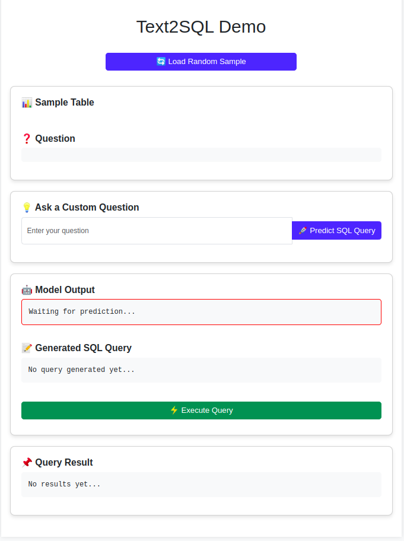

# Text-to-SQL (T2SQL) Project

 

## Introduction

The **Text-to-SQL (T2SQL) Project** is an AI-powered tool that converts natural language queries into SQL statements. This enables users to interact with databases effortlessly, without requiring SQL expertise. By leveraging machine learning and natural language processing (NLP), the system translates human-readable questions into executable database queries.

## Installation and Setup

Follow the steps below to set up and run the project:

### 1. Create a Conda Environment

First, create a new Conda environment with Python 3.12.4:

```sh
conda create -n t2sql python==3.12.4
conda activate t2sql
```

### 2. Install Dependencies

Install the necessary dependencies from the `requirements.txt` file:

```sh
pip install -r requirements.txt
```

### 3. Navigate to the Backend Directory

Move into the backend folder where the main server script is located:

```sh
cd backend
```

### 4. Run the Backend Server

Start the application by running:

```sh
python main.py
```

The server will now be running and ready to process text-to-SQL queries.

## Usage

Once the server is up and running, you can send natural language queries to the API, and it will return SQL statements that can be executed on a database.

Example:

- **Input (Natural Language Query):**  
  *"who is the the candidates with incumbent being james o'connor*

- **Output (SQL Query):**  
  ```sql
  SELECT COUNT Candidates FROM table WHERE Incumbent = James O'Connor;
  ```
- **Output (Canonical Form)**
  ```
  {
  "sel": 5,
  "agg": 3,
  "conds": [
    [
      1,
      0,
      "James O'Connor"
    ]
  ]
  }
  ```
